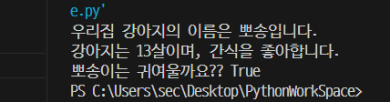

### 파이썬을 공부하는 공간입니다.

----------------------------------------------------------
## 1일차 - 간단한 자료형 학습.

animal = "강아지"
name = "뽀송이"
age = 13
hobby = "간식"
is_cute = name == "뽀송이"

print("우리집 " + animal + "의 이름은 뽀송입니다.")
print( animal + "는 " + str(age) + "살이며, " + hobby + "을 좋아합니다.")
print("뽀송이는 귀여울까요?? " + str(is_cute) )

----------------------------------------------------------
